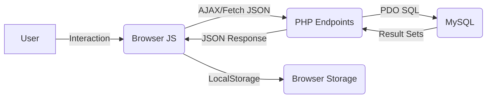

# System Architecture - Web Expense Tracker

This document describes the high-level design, data flow, and architectural patterns of the project.

## 1. Overview
The "Web Expense Tracker" is a specialized **Progressive Web App (PWA)** built with a PHP backend and a Vanilla JavaScript frontend. It follows a client-server architecture where the frontend behaves like a Single Page Application (SPA), managing state locally while synchronizing with a centralized MySQL database.

## 2. Data Flow
The system uses a bidirectional JSON-based data flow:

## 3. Communication Patterns (REST-ish)
The frontend communicates with the backend via the Fetch API using standard HTTP verbs:
- **GET**: Retrieve transactions and summaries (Triggers "Lazy Recurring" auto-logging).
- **POST**: Create new transaction or register user.
- **PUT**: Update existing transaction details.
- **DELETE**: Remove transaction and associated assets (receipts).

## 4. PWA Architecture & Offline Strategy
One of the core features is its offline robustness:
- **Service Worker (`sw.js`)**: Implements a "Network-First" strategy for static assets, ensuring the user always sees the latest UI if online, but has a working app if offline.
- **Manual Sync Queue**: Instead of using the Background Sync API, the app implements a custom `offlineQueue` in `localStorage`.
- **Optimistic UI**: When offline, new transactions are displayed immediately with a "Pending" icon and a negative temporary ID, then synced with the server once connection is restored.

## 5. Security Abstractions
- **Session Auth**: Managed via PHP `session_start()` and local session cookies.
- **Data Protection**: 
    - `PDO` prepared statements are used for all database queries to prevent SQL Injection.
    - `htmlspecialchars` and `strip_tags` are used on the backend to mitigate XSS.
    - Input sanitization on the client-side before sending payloads.

## 6. Optimization Features
- **Client-side Compression**: Images (receipts) are compressed using the Canvas API before being sent to the server as base64 strings to save bandwidth and storage.
- **Lazy Recurring Logic**: Recurring expenses are calculated and inserted by the PHP backend during the first GET request of a session, avoiding the need for a server-side CRON job.
